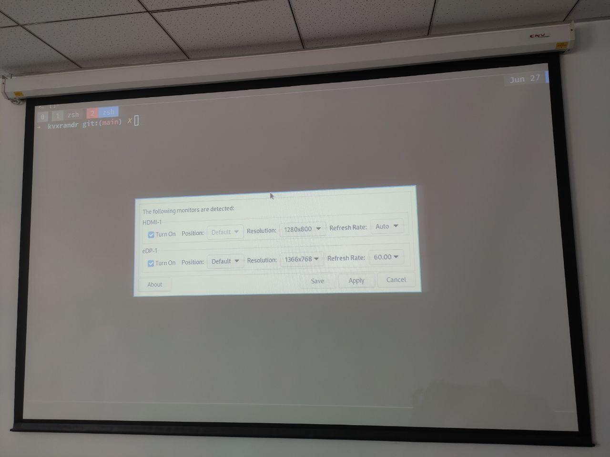

# kvxrandr

`kvxrandr`是一款允许用户添加所需要的分辨率的屏幕管理器。目前`kvxrandr`只支持外接一块屏幕或一个投影仪。

如果您在使用`lxrandr`的时候，即使是调整到最好的投影效果，也会出现类似的画面截断情况，或者画面过小的情况。大多数情况是因为由于硬件或驱动的原因，`xrandr` 不能检测出您的显示器所有的有效分辨率^[https://wiki.archlinux.org/title/Xrandr_(%E7%AE%80%E4%BD%93%E4%B8%AD%E6%96%87)]。这种情况下您可以选择使用`kvxrandr`。
（图片不是很清晰:sweat:）

- `lxrandr`显示
<table><tr>
<td></td>
<td></td>
</tr></table>

- `kvxrandr`显示
<table> <center>

</center> </table>

如果您不喜欢GUI操作，可以参考ArchWiki中的[Xrandr 添加未检测到的分辨率](https://wiki.archlinux.org/title/Xrandr_(%E7%AE%80%E4%BD%93%E4%B8%AD%E6%96%87)#%E6%B7%BB%E5%8A%A0%E6%9C%AA%E6%A3%80%E6%B5%8B%E5%88%B0%E7%9A%84%E5%88%86%E8%BE%A8%E7%8E%87)。

# 用法

<center>

</center>

**说明：** 这里以我的笔记本投影为例进行说明，我笔记本屏幕对应的名字是`eDP-1`，外接投影仪对应的名字是`HDMI-1`。

- 如果需要修改笔记本屏幕的分辨率，选择`eDP-1`下对应的分辨率下拉框，选择好分辨率后，点击这一行最后的确定按钮（这里是没反应的，因为我没有做这个，很少有人改这个吧，以后有时间再加上吧，虽然很简单:neutral_face:）

- 如果不需要自定义分辨率，投影时选择外接设备的名字，例如我这里选中`HDMI-1`，选择`HDMI-1`下对应的分辨率下拉框，从中选择想要的分辨率，再选择一个投影选项（这个选项也适用于自定义分辨率），然后最后按一下这一行的确定按钮。

- 如果需要自定义分辨率，投影时选择外接设备的名字`HDMI-1`，在最下方输入想要的长度和宽度，选择一个想要投影位置，点击最下方的确定按钮。如果长度和宽度没有输入任何值，则按照默认值进行投影，默认值为1368 x 768

# 安装
```bash
git clone https://github.com/demonlord1997/kvxrandr
sudo make install
```
`kvxrandr`将会安装在`/usr/local/bin`目录下。

# 卸载
```bash
sudo make uninstall
```

# TODO
- [ ] 添加修改主屏幕分辨率的功能
- [ ] 添加窗口缩放功能
- [ ] 支持多块外接屏幕
